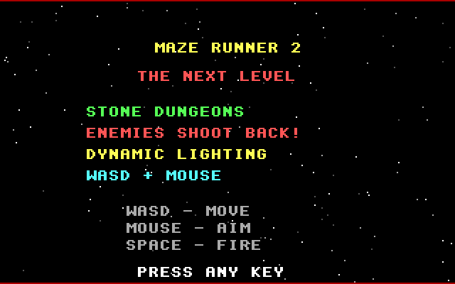
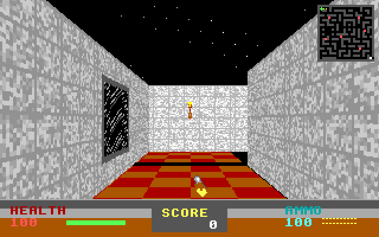
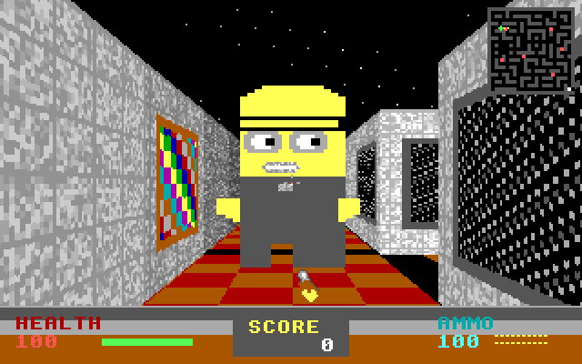
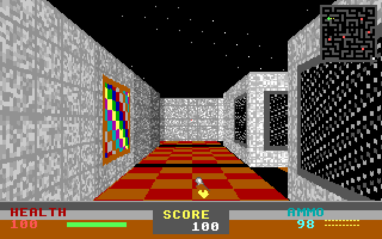
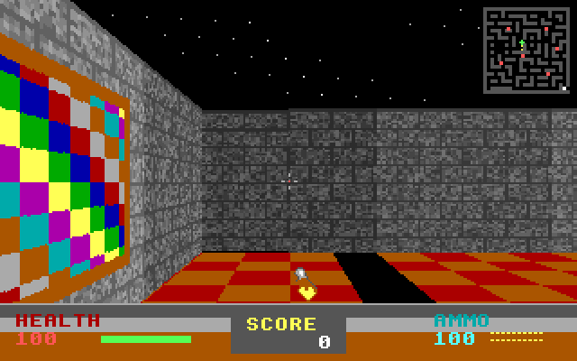
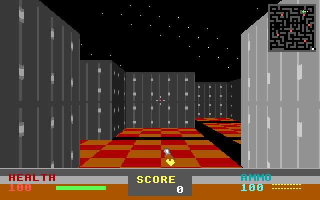

# MAZE RUNNER 2 — The Next Level

A first-person raycasting shooter for MS-DOS. Enemies shoot back, the dungeon is
torch-lit, and the whole thing is one self-contained `MAZE2.EXE` that runs on
anything from a Pentium in DOS mode to DOSBox.

 
 
 

## Play it

Grab `MAZE2.zip` (or `MAZE2.IMG`, a 1.44 MB floppy image) from the
[latest release](https://github.com/VonHoltenCodes/Von_Holten-maze-game-2/releases),
put the files in one directory and run `MAZE2`. `dos/README.TXT` is the DOS-side
manual.

| Key | Action |
|---|---|
| W / S, Up / Down | move forward / back |
| A / D | strafe |
| Left / Right | turn (keyboard-only play works) |
| Mouse | look and turn |
| SPACE, CTRL, left button | fire |
| F1 | FPS / position overlay |
| ESC | quit |

Reach the exit in the south-east corner (blinking marker on the mini map).
Soldiers and the elite respawn 10 s after they die.

Requirements: 486 or better with VGA (built for the i586 instruction set), any DOS
from MS-DOS 5 to FreeDOS, a Windows 9x DOS box, Windows XP's NTVDM, or DOSBox.
Optional: Sound Blaster for effects (`SET BLASTER` honoured), any OPL FM chip for
the MIDI soundtrack, a mouse driver for mouse look. `MAZE2 -nosound` skips the sound
hardware entirely.

## What's in the box

- DDA raycaster, 320x200x256, 64x64 procedural wall textures (brick, stone, metal,
  tech), wall paintings and broken TVs, torch light baked per cell, distance fog
- Grunts, soldiers and an elite with line-of-sight ranged AI and a projectile system
- Doom-style status bar, mini map with enemies and exit, weapon sprite
- INT 9 key-state keyboard driver, frame-rate independent movement
- Sound Blaster 8-bit DMA effects with PC-speaker fallback, all non-blocking
- Background MIDI over AdLib/OPL through Steven H Don's `MIDIPLAY.C`
- VGA title / credits / scrolling end credits with a parallax starfield

## Building

Needs the DJGPP cross-compiler (`i586-pc-msdosdjgpp-gcc`, GCC 12; on devbase1 it
lives in `~/djgpp/bin`), GNU make and Python 3. `make dist` also wants `mtools`,
`dosfstools` and `zip`.

```sh
tools/build.sh            # build/MAZE2.EXE with FM.DAT + 1.MID beside it
tools/build.sh dist       # + dist/MAZE2.IMG floppy image and dist/MAZE2.zip
tools/dos-shots.py        # play it in dosbox-x on a virtual display, screenshot every stage
tools/dos-shots.py --photos   # regenerate screenshots/ for this README
tools/stage-dos.sh        # copy the build to the GX1 (Win98) and RetroBeast (XP) test boxes
```

The link step swaps the default DJGPP stub for `CWSDSTUB.EXE` (CWSDPMI r7), so the
EXE carries its own DPMI host. CI (`.github/workflows/build.yml`) builds every push
and attaches `MAZE2.EXE`, `MAZE2.IMG` and `MAZE2.zip` to `v*` tag releases.

```
src/            maze2.c (game), keyboard.c (INT 9 driver), sound.c (SB DMA / PC speaker), sprites/
third_party/    midiplay/ - MIDIPLAY.C + FM.DAT + songs by Steven H Don (see NOTICE.md for local fixes)
assets/         music/ (shipped beside the EXE), legacy-art/ (converted headers not yet used)
dos/            CWSDSTUB.EXE, README.TXT, MAZE2.BAT - what ships next to the EXE
tools/          build, stub binding, dosbox-x tour, staging to the retro boxes
docs/           hardware photos
screenshots/    README images, generated by tools/dos-shots.py --photos
```

`MAZE2 -at X Y DEGREES` spawns at a map position facing a heading; it exists for
screenshots and testing.

## Debugging notes

- The DOS clock and any timing built on it ran 7-15x fast while music played,
  because the MIDI player chained the BIOS timer on every one of its interrupts.
  Fixed in `third_party/midiplay` (see `NOTICE.md`); game timing uses the BIOS
  tick counter, which stays honest now.
- Sound Blaster DMA used to be programmed with a protected-mode `malloc()` pointer.
  It is real DOS memory now, positioned to never cross a 64 KB DMA page.
- `-march=i586`: the first build used `-march=pentium4` and died with SIGILL on
  anything older (`docs/hardware-photos/`).

See `CHANGELOG.md` for the full 2.1 list.

## Evolution from Maze Runner 1

| | [Maze Runner 1](https://github.com/VonHoltenCodes/Von_Holten-Maze-Game) | Maze Runner 2 |
|---|---|---|
| Target CPU | 133 MHz Pentium | 486+ (tuned on a Pentium 4) |
| Textures | 8x8 hardcoded | 64x64 procedural + decorations |
| Enemies | melee only | ranged, they shoot back |
| Controls | arrows | WASD + mouse, or keyboard only |
| Music | AdLib sequencer | OPL MIDI playback |

## Credits

**Game, engine, art:** Trent Von Holten / VonHoltenCodes, 2025.
**MIDI playback:** Steven H Don (`MIDIPLAY.C`, `FM.DAT`, songs), 1999.
**DPMI host:** CWSDPMI r7, Charles W Sandmann. **Compiler:** DJGPP.
Based on the Maze Runner v3.0 foundation. Open source.
